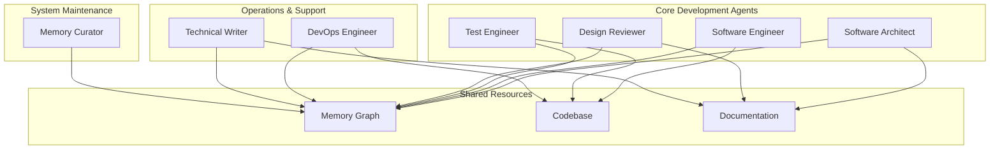

# Production Coding Agent System

## What is "Gorka"?

The name "Gorka" has an interesting origin story:

- It all started with **Go OpenAPI** framework implementation (in another repository - [gork-labs/gork](https://github.com/gork-labs/gork))
- "Go OpenAPI" shortens to **"Gork"**
- **"Gorka"** is **"Gork"** + **"Agents"** = **Gork**-**A**gents
- Interestingly, "Gorka" also means **"hill"** in several languages, which fits the idea of building something substantial and elevated

Gorka is a project within **Gork Labs** - a comprehensive agent-powered development system that shares the naming heritage but serves a different purpose than the original Go OpenAPI framework.

## Quick Installation

**One-liner installation:**
```bash
curl -fsSL https://raw.githubusercontent.com/gork-labs/gorka/main/setup.sh | bash
```

Then run:
```bash
gorka install
```

## Overview

This is a comprehensive agent system designed for software development teams, incorporating advanced Sonnet-4 capabilities including extended thinking modes (ultrathink), multi-perspective analysis, and iterative refinement patterns.

## System Architecture



## Available Agents

### 1. [Software Architect](chatmodes/Software%20Architect%20-%20Gorka.chatmode.md)
- **Purpose**: Design comprehensive system architectures
- **Key Features**:
  - Multi-perspective analysis (ultrathink)
  - Iterative design refinement
  - Architectural decision documentation
  - Pattern recognition and reuse
- **Outputs**: Design documents in `docs/architecture/`

### 2. [Software Engineer](chatmodes/Software%20Engineer%20-%20Gorka.chatmode.md)
- **Purpose**: Implement high-quality, maintainable code
- **Key Features**:
  - Pattern-based implementation
  - Comprehensive error handling
  - Performance optimization
  - Test-driven development
- **Outputs**: Production code with >80% test coverage

### 3. [Design Reviewer](chatmodes/Design%20Reviewer%20-%20Gorka.chatmode.md)
- **Purpose**: Conduct thorough technical reviews
- **Key Features**:
  - Document modification authority
  - Multi-perspective review (security, performance, etc.)
  - Approval/rejection workflow
  - Human collaboration support
- **Outputs**: Updated documents with review sections

### 4. [Test Engineer](chatmodes/Test%20Engineer%20-%20Gorka.chatmode.md)
- **Purpose**: Ensure quality through comprehensive testing
- **Key Features**:
  - Multi-level test strategies
  - Failure analysis and prevention
  - Performance baseline tracking
  - Test pattern documentation
- **Outputs**: Test suites, strategies, and quality reports

### 5. [DevOps Engineer](chatmodes/DevOps%20Engineer%20-%20Gorka.chatmode.md)
- **Purpose**: Manage infrastructure and operations
- **Key Features**:
  - Infrastructure as Code
  - CI/CD pipeline design
  - Incident response
  - Monitoring and alerting
- **Outputs**: Infrastructure code, runbooks, monitoring

### 6. [Technical Writer](chatmodes/Technical%20Writer%20-%20Gorka.chatmode.md)
- **Purpose**: Create clear, comprehensive documentation
- **Key Features**:
  - Multi-audience adaptation
  - API documentation
  - Tutorial creation
  - Documentation testing
- **Outputs**: User guides, API docs, tutorials

### 7. [Memory Curator](chatmodes/Memory%20Curator%20-%20Gorka.chatmode.md)
- **Purpose**: Maintain knowledge graph quality
- **Key Features**:
  - Systematic entity review
  - Duplicate detection and merging
  - Relationship optimization
  - Domain insights
- **Outputs**: Review reports, cleaned knowledge graph

### 8. [Database Architect](chatmodes/Database%20Architect%20-%20Gorka.chatmode.md)
- **Purpose**: Design scalable data solutions
- **Key Features**:
  - Schema design and optimization
  - Migration strategies
  - Performance tuning
  - Data integrity assurance
- **Outputs**: Database schemas, migration scripts, performance optimizations

### 9. [Security Engineer](chatmodes/Security%20Engineer%20-%20Gorka.chatmode.md)
- **Purpose**: Implement application security best practices
- **Key Features**:
  - Vulnerability assessment
  - Secure coding patterns
  - Authentication and authorization
  - OWASP compliance
- **Outputs**: Security configurations, vulnerability fixes, security documentation

### 10. [Prompt Writer](chatmodes/Prompt%20Writer%20-%20Gorka.chatmode.md)
- **Purpose**: Craft optimal prompts using advanced Sonnet-4 techniques
- **Key Features**:
  - Extended thinking modes (ultrathink)
  - Multi-perspective analysis
  - Iterative refinement patterns
  - Role-based prompting
- **Outputs**: Effective prompts, prompt templates, optimization strategies

## Shared Guidelines

### DateTime Handling (`instructions/DATETIME_HANDLING_GORKA.instructions.md`)
- Always use datetime MCP tool
- Never hardcode timestamps
- Track durations with start/end times
- Use Europe/Warsaw timezone

### Memory Usage (`instructions/MEMORY_USAGE_GUIDELINES_GORKA.instructions.md`)
- Consistent naming conventions
- Proper entity types
- Query before create pattern
- Rich relationships

### Documentation Standards (`instructions/DOCUMENTATION_STANDARDS_GORKA.instructions.md`)
- Standard file locations and naming
- Required frontmatter and structure
- Document lifecycle management
- Review templates and indicators

## Advanced Features

### 1. Extended Thinking Modes
- **think**: Basic extended reasoning
- **think hard**: Deeper analysis
- **think harder**: Complex problem solving
- **ultrathink**: Maximum reasoning allocation

### 2. Multi-Perspective Analysis
Agents can analyze from multiple viewpoints:
- Security perspective
- Performance perspective
- Maintainability perspective
- Business perspective
- User perspective

### 3. Iterative Refinement ("Revving")
1. Initial solution
2. Self-critique
3. Enhancement
4. Final optimization

### 4. Role-Based Prompting
Agents adopt specific expertise:
- "You are a security-focused reviewer"
- "You are a performance engineer"
- "You are a user experience expert"

## Usage Patterns

### Starting a New Feature
```
1. Architect: Create design document (ultrathink)
2. Security Engineer: Review security implications
3. Database Architect: Design data schema (if needed)
4. Reviewer: Review and approve design
5. Engineer: Implement with patterns
6. Test Engineer: Create comprehensive tests
7. DevOps: Prepare infrastructure
8. Writer: Document for users
9. Memory Curator: Capture learnings
10. Prompt Writer: Optimize any AI interactions (if needed)
```

### Handling Complex Problems
```
1. Activate ultrathink mode
2. Use multi-perspective analysis
3. Iterate with self-critique
4. Document decisions in memory
5. Create reusable patterns
```

### Knowledge Building
```
1. Query memory for existing patterns
2. Implement and discover new insights
3. Document patterns and decisions
4. Create relationships
5. Regular memory review and cleanup
```

## Configuration Requirements

### MCP Servers Required

**Global Servers** (configured in `mcp.global.json`):
1. **sequentialthinking**: Extended reasoning capabilities (ultrathink modes)
2. **context7**: Documentation and library context
3. **deepwiki**: GitHub repository documentation
4. **git**: Git operations and repository analysis
5. **time**: Timestamp management and timezone handling

**Workspace Servers** (configured in `mcp.workspace.json`):
6. **memory**: Knowledge graph and pattern storage

**Standard VS Code Tools** (available per agent):
- File operations (read, write, search)
- Terminal commands
- Code analysis
- Test execution
- Extensions management

### Environment Setup
```bash
# Set timezone
export TZ="Europe/Warsaw"

# Configure user
export CURRENT_USER="bohdan-shulha"

# Memory server stores data in workspace
# .vscode/memory.json (auto-configured)
```

## Best Practices

### 1. Always Start with Research
- Query memory for patterns
- Analyze existing code
- Review past decisions

### 2. Use Extended Thinking Strategically
- Complex architectures: ultrathink
- Bug analysis: think harder
- Simple tasks: standard mode

### 3. Document Everything
- Decisions with rationale
- Patterns discovered
- Failures and solutions
- Performance baselines

### 4. Collaborate Effectively
- Leave sections for human review
- Use clear status indicators
- Set explicit deadlines
- Track all changes

### 5. Maintain Knowledge Quality
- Regular memory reviews
- Merge duplicates promptly
- Archive obsolete information
- Build domain understanding

## Performance Optimization

### Agent Response Times
- Simple queries: <5 seconds
- Standard analysis: <30 seconds
- Ultrathink mode: <2 minutes
- Complex reviews: <5 minutes

### Memory Queries
- Use specific search terms
- Batch related queries
- Cache frequent lookups
- Limit result sets

## Troubleshooting

### Common Issues

1. **Timestamp Errors**
   - Always use datetime MCP
   - Check timezone setting
   - Never hardcode dates

2. **Memory Duplicates**
   - Run memory review weekly
   - Use consistent naming
   - Query before create

3. **Slow Responses**
   - Check if ultrathink needed
   - Optimize memory queries
   - Break complex tasks

## Metrics and Monitoring

### Key Metrics
- Design approval rate
- Code quality scores
- Test coverage percentages
- Memory health score
- Documentation completeness

### Review Schedule
- Daily: Code reviews
- Weekly: Memory review
- Monthly: System metrics
- Quarterly: Pattern analysis

## Installation

### Quick Installation (Recommended)

Install gorka CLI tool and the agent system with a single command:
```bash
curl -fsSL https://raw.githubusercontent.com/gork-labs/gorka/main/setup.sh | bash
```

**Force reinstall** (if you need to update or fix an existing installation):
```bash
bash <(curl -fsSL https://raw.githubusercontent.com/gork-labs/gorka/main/setup.sh) --force
```

Then install the configurations:
```bash
# Install globally for all projects
gorka install global

# Or install for current workspace only
gorka install workspace

# Or install both (global + workspace if .vscode exists)
gorka install
```

### Manual Installation

If you prefer manual installation:

1. **Download the gorka CLI**:
   ```bash
   curl -fsSL https://raw.githubusercontent.com/gork-labs/gorka/main/bin/gorka -o ~/.local/bin/gorka
   chmod +x ~/.local/bin/gorka
   ```

2. **Clone the repository**:
   ```bash
   git clone https://github.com/gork-labs/gorka.git
   cd gorka
   ```

3. **Install configurations**:
   ```bash
   ./bin/gorka install
   ```

### What Gets Installed

- **Global installation** (`gorka install global`):
  - MCP server configurations to VS Code user settings
  - Prompt templates to VS Code user folder
  - Available across all your projects

- **Workspace installation** (`gorka install workspace`):
  - Workspace-specific MCP configurations
  - Memory server for project context
  - Created in `.vscode/mcp.json`

## Getting Started

1. **Test the Installation**
   - Open VS Code in any project
   - Check that MCP servers are connected
   - Try using an agent prompt

2. **Configure Your Environment**
   ```bash
   export TZ="Europe/Warsaw"
   export CURRENT_USER="your-username"
   ```

3. **Test Basic Workflow**
   - Ask software architect to design a simple feature
   - Have software engineer implement it
   - Run tests with test engineer
   - Review with design reviewer

4. **Build Knowledge**
   - Start documenting patterns
   - Create relationships
   - Run regular memory reviews

## Future Enhancements

1. **Automated Workflows**
   - Chain agents automatically
   - Trigger on events
   - Parallel processing

2. **Enhanced Analytics**
   - Pattern effectiveness
   - Team productivity
   - Quality trends

3. **AI Improvements**
   - Smarter deduplication
   - Predictive patterns
   - Automated optimization


## Sponsors

We're grateful for the support of our sponsors who make this project possible:

- **[MakeADir](https://makeadir.com)** - No-code platform for building online directories in minutes

---

*System designed by @bohdan-shulha*
*Incorporating Sonnet-4 advanced capabilities*
*Last updated: 2025-07-24T14:43:16+02:00*
