# SecondBrain MCP Server (Gorka)

A Model Context Protocol (MCP) server that provides intelligent agent spawning and coordination capabilities for VS Code. This project implements a dual-executable architecture with both an MCP server for VS Code integration and a CLI tool for workspace management.

## What is "Gorka"?

The name "Gorka" has an interesting origin story:

- It all started with OpenAPI-targeted **Go Framework** implementation (in another repository - [gork-labs/gork](https://github.com/gork-labs/gork))
- "Go Framework" shortens to **"Gork"**
- **"Gorka"** is **"Gork"** + **"Agents"** = **Gork**-**A**gents
- Interestingly, "Gorka" also means **"hill"** in several languages, which fits the idea of building something substantial and elevated

Gorka is a project within **Gork Labs** - a comprehensive agent-powered development system that shares the naming heritage but serves a different purpose than the original Go Framework.

## Features

- **Dual Architecture**: MCP server for VS Code integration + CLI tool for standalone management
- **Agent Coordination**: Spawn and coordinate specialized agents (Project Orchestrator, Software Engineer, Security Engineer)
- **OpenRouter Integration**: Uses OpenRouter API for LLM capabilities via OpenAI SDK
- **Environment-Based Configuration**: No config files - everything via environment variables
- **Concurrency Control**: Configurable parallel agent limits with semaphore-based management
- **Quality Validation**: Built-in output validation and quality assessment

## Quick Start

### Option 1: One-Line Installation (Recommended)

Download and install Gorka with a single command:

```bash
bash <(curl -fsSL https://github.com/gork-labs/gorka/releases/latest/download/gorka)
```

This will:
- Download the latest `secondbrain-cli` and `secondbrain-mcp` binaries
- Install them to `~/.local/bin`
- Add the `gorka` management script to your system
- Provide instructions to update your PATH

After installation, follow the displayed instructions to add `~/.local/bin` to your PATH.

### Option 2: Development Installation

### Prerequisites

- Go 1.21+
- OpenRouter API key
- VS Code (for MCP server usage)

### Installation

1. Clone and build:
```bash
git clone <repository-url>
cd agents
make deps
make build
```

For cross-platform release builds:
```bash
make build-release
```
This creates binaries for Linux, macOS, and Windows in `bin/release/`.

2. Set environment variables:
```bash
export OPENROUTER_API_KEY="your-api-key"
export SECONDBRAIN_MODEL="anthropic/claude-3.5-sonnet"
export SECONDBRAIN_WORKSPACE="/path/to/your/workspace"
export SECONDBRAIN_MAX_PARALLEL_AGENTS=3
```

3. The CLI tool is ready to use:
```bash
./secondbrain-cli version
```

## Gorka Management Script

The `gorka` script provides a unified interface for managing the Gorka system:

```bash
# Install or upgrade the system
gorka install

# Upgrade the gorka script itself
gorka self-upgrade

# Get help
gorka help

# All other commands are passed to secondbrain-mcp
gorka components list
gorka chatmodes generate
gorka server start
```

### VS Code MCP Integration

Configure VS Code MCP in `.vscode/mcp.json`:

```json
{
  "servers": {
    "secondbrain-gorka": {
      "command": "secondbrain-mcp",
      "args": [],
      "env": {
        "OPENROUTER_API_KEY": "${OPENROUTER_API_KEY}",
        "SECONDBRAIN_MODEL": "${SECONDBRAIN_MODEL}",
        "SECONDBRAIN_WORKSPACE": "${SECONDBRAIN_WORKSPACE}",
        "SECONDBRAIN_MAX_PARALLEL_AGENTS": "${SECONDBRAIN_MAX_PARALLEL_AGENTS}"
      }
    }
  }
}
```

## Environment Variables

### Required
- `OPENROUTER_API_KEY`: Your OpenRouter API key
- `SECONDBRAIN_MODEL`: Model name (e.g., "anthropic/claude-3.5-sonnet")
- `SECONDBRAIN_WORKSPACE`: Workspace directory path
- `SECONDBRAIN_MAX_PARALLEL_AGENTS`: Max concurrent agents (recommended: 3-5)

### Optional
- `SECONDBRAIN_LOG_LEVEL`: Logging level (default: "info")
- `SECONDBRAIN_REQUEST_TIMEOUT`: API timeout in seconds (default: 60)
- `SECONDBRAIN_MAX_CONTEXT_SIZE`: Token limit (default: 50000)
- `SECONDBRAIN_OPENROUTER_BASE_URL`: API endpoint (default: "https://openrouter.ai/api/v1")

## Available Agents

### Project Orchestrator
Coordinates multiple specialized agents for complex tasks. Handles task decomposition, agent coordination, and result synthesis.

### Software Engineer
Specializes in code analysis, software design, debugging, and technical documentation.

### Security Engineer
Focuses on security analysis, threat modeling, vulnerability assessment, and compliance review.

## CLI Commands

```bash
# Show version
./secondbrain-cli version

# Get help
./secondbrain-cli --help
```

## Table of Contents

- [Overview](#overview)
  - [🧠 Core Innovation: Sequential Thinking](#-core-innovation-sequential-thinking)
- [🚀 Quick Links](#-quick-links)
  - [New Users](#new-users)
  - [Developers](#developers)
  - [Administrators](#administrators)
- [Installation](#installation)
  - [Prerequisites](#prerequisites)
  - [Quick Installation (Recommended)](#quick-installation-recommended)
  - [Manual Installation](#manual-installation)
  - [What Gets Installed](#what-gets-installed)
  - [System Management](#system-management)
- [System Architecture](#system-architecture)
  - [Core Foundations](#core-foundations)
  - [Agent Specializations](#agent-specializations)
  - [Integration Features](#integration-features)
- [Available Agents](#available-agents)
  - [1. Software Architect](#1-software-architect)
  - [2. Software Engineer](#2-software-engineer)
  - [3. Design Reviewer](#3-design-reviewer)
  - [4. Test Engineer](#4-test-engineer)
  - [5. DevOps Engineer](#5-devops-engineer)
  - [6. Technical Writer](#6-technical-writer)
  - [7. Memory Curator](#7-memory-curator)
  - [8. Database Architect](#8-database-architect)
  - [9. Security Engineer](#9-security-engineer)
  - [10. Prompt Writer](#10-prompt-writer)
- [Shared Guidelines](#shared-guidelines)
- [Advanced Features](#advanced-features)
  - [1. Extended Thinking Modes](#1-extended-thinking-modes)
  - [2. Multi-Perspective Analysis](#2-multi-perspective-analysis)
  - [3. Iterative Refinement ("Revving")](#3-iterative-refinement-revving)
  - [4. Role-Based Prompting](#4-role-based-prompting)
- [Usage Patterns](#usage-patterns)
- [Configuration Requirements](#configuration-requirements)
  - [MCP Servers Required](#mcp-servers-required)
  - [Environment Setup](#environment-setup)
- [Best Practices](#best-practices)
- [Performance Optimization](#performance-optimization)
- [Troubleshooting](#troubleshooting)
- [Metrics and Monitoring](#metrics-and-monitoring)
- [Getting Started](#getting-started)
- [Key Documentation](#key-documentation)
- [Future Enhancements](#future-enhancements)
- [Sponsors](#sponsors)

## Overview

This is a comprehensive agent system designed for software development teams, incorporating advanced Sonnet-4 capabilities including **mandatory sequential thinking (7-15 thoughts minimum)**, extended thinking modes (ultrathink), multi-perspective analysis, and iterative refinement patterns.

### 🧠 Core Innovation: Sequential Thinking
Every complex task now requires structured thinking using the `mcp_sequentialthi_sequentialthinking` tool, ensuring:
- **Minimum 7 thoughts** for simple analysis
- **10-12 thoughts** for standard problems
- **13-15+ thoughts** for complex architecture decisions
- **Progressive insight building** with revision capabilities
- **Multi-perspective analysis** for comprehensive solutions

## 🚀 Quick Links

### New Users
- **[Installation Guide](#installation)** - Get started with Gorka in minutes
- **[Complete Documentation](docs/README.md)** - Comprehensive guides and references
- **[User Onboarding Guide](docs/guides/user-onboarding-guide.md)** - Step-by-step introduction
- **[Sequential Thinking Guide](docs/guides/sequential-thinking-guide.md)** - Understanding Gorka's thinking requirements

### Developers
- **[Available Agents](#available-agents)** - Choose the right agent for your task
- **[Usage Patterns](#usage-patterns)** - Common workflows and best practices
- **[Shared Guidelines](#shared-guidelines)** - Essential standards and conventions
- **[Advanced Features](#advanced-features)** - Extended capabilities and techniques

### Administrators
- **[System Management](#system-management)** - CLI tools and maintenance
- **[Configuration Requirements](#configuration-requirements)** - MCP servers and environment setup
- **[System Maintenance Guide](docs/guides/system-maintenance-guide.md)** - Keep Gorka running optimally
- **[CLI Reference](docs/cli/gorka-cli-reference.md)** - Complete command documentation

## System Architecture

Gorka provides a comprehensive AI agent ecosystem built on three foundational pillars:

### Core Foundations

- **🧠 Sequential Thinking**: All agents use structured reasoning (7-15 thought minimum) for complex analysis
- **💾 Memory Integration**: Persistent knowledge graph tracking domain concepts and decisions
- **📝 Documentation Standards**: Comprehensive guides and references for every component

### Agent Specializations

```mermaid
graph TB
    subgraph "Core Architecture & Design"
        A[Software Architect]
        B[Design Reviewer]
        C[Database Architect]
    end

    subgraph "Development & Quality"
        D[Software Engineer]
        E[Test Engineer]
        F[Security Engineer]
    end

    subgraph "Operations & Documentation"
        G[DevOps Engineer]
        H[Technical Writer]
        I[Prompt Writer]
    end

    subgraph "System Intelligence"
        J[Memory Curator]
        K[Sequential Thinking Engine]
    end

    subgraph "Shared Infrastructure"
        L[Memory Graph]
        M[Knowledge Base]
        N[Documentation System]
        O[Gorka CLI]
    end

    A --> L
    B --> L
    C --> L
    D --> L
    E --> L
    F --> L
    G --> L
    H --> L
    I --> L
    J --> L
    K --> L

    A --> N
    B --> M
    C --> M
    D --> M
    E --> N
    F --> N
    G --> N
    H --> N
    I --> N

    J --> M
    K --> M
    O --> N
```



### Integration Features

- **🔄 Self-Upgrading System**: `gorka self-upgrade` keeps the CLI and agents current
- **📦 Component Management**: Add, remove, and sync agent configurations
- **🔍 Metadata Tracking**: Comprehensive component lifecycle management

## Installation

### Prerequisites

Before installing Gorka, ensure you have the following requirements:

#### Required Software
- **Visual Studio Code**: Latest version
- **Git**: For repository operations
- **Node.js**: For MCP server functionality
- **uv**: Python package manager ([installation guide](https://docs.astral.sh/uv/))

#### Essential VS Code Extensions
- **[GitHub Copilot](https://marketplace.visualstudio.com/items?itemName=GitHub.copilot)**: Core AI assistance
- **[GitHub Copilot Chat](https://marketplace.visualstudio.com/items?itemName=GitHub.copilot-chat)**: Interactive AI conversations

#### Recommended Configuration
- **GitHub Copilot Pro Subscription**: For optimal performance and features
- **Claude 4 Sonnet**: Best AI model compatibility with Gorka's sequential thinking
- **Operating System**: macOS or Linux (Windows support via WSL)

### Quick Installation (Recommended)

Install gorka CLI tool and the agent system with a single command:
```bash
bash <(curl -fsSL https://github.com/gork-labs/gorka/releases/latest/download/gorka)
```

After installation, follow the displayed instructions to add `~/.local/bin` to your PATH.
```bash
Then you can manage your system:
```bash
# Check what's installed
gorka --help

# Keep system updated
gorka self-upgrade          # Upgrade gorka binary itself
```

### Manual Installation

If you prefer manual installation:

1. **Download the gorka installer**:
   ```bash
   curl -fsSL https://github.com/gork-labs/gorka/releases/latest/download/gorka -o gorka
   chmod +x gorka
   ```

2. **Run the installer**:
   ```bash
   ./gorka install
   ```

3. **Follow the PATH instructions** displayed after installation.

### What Gets Installed

- **Workspace installation** (`gorka install`):
  - MCP server configurations to `.vscode/mcp.json`
  - Chatmodes and instructions to `.github/` directory
  - Memory server for project context and knowledge storage
  - All components available within the current project
  - Instructions copied to `.github/instructions/`

### System Management

The gorka system includes comprehensive management tools:

```bash
# List installed components
gorka update list               # Show all components
gorka update list available     # Show available from repository

# Sync with latest repository
gorka update sync              # Update everything
gorka update sync workspace    # Update workspace only

# Remove components
gorka update remove server memory workspace
gorka update remove chatmode "Old Agent.md"

# Clean up orphaned components
gorka update clean-orphans     # Remove components no longer in repo

# Upgrade gorka itself
gorka self-upgrade             # Safe binary update with backup
```

## Available Agents

### 1. [Software Architect](chatmodes/Software%20Architect%20-%20Gorka.chatmode.md)
- **Purpose**: Design comprehensive system architectures
- **Key Features**:
  - **Sequential thinking (10-15 thoughts minimum) for complex designs**
  - Multi-perspective analysis (ultrathink)
  - Iterative design refinement
  - Architectural decision documentation
  - Pattern recognition and reuse
  - **Document creation focus (no code implementation)**
- **Outputs**: Design documents in `docs/architecture/`

### 2. [Software Engineer](chatmodes/Software%20Engineer%20-%20Gorka.chatmode.md)
- **Purpose**: Implement high-quality, maintainable code
- **Key Features**:
  - **Sequential thinking (8-12 thoughts) for implementation planning**
  - Pattern-based implementation
  - Comprehensive error handling
  - Performance optimization
  - Test-driven development
- **Outputs**: Production code with >80% test coverage

### 3. [Design Reviewer](chatmodes/Design%20Reviewer%20-%20Gorka.chatmode.md)
- **Purpose**: Conduct thorough technical reviews
- **Key Features**:
  - **Sequential thinking (8-12 thoughts) for comprehensive reviews**
  - Document modification authority
  - Multi-perspective review (security, performance, etc.)
  - Approval/rejection workflow
  - Human collaboration support
  - **Design document focus (no code review)**
- **Outputs**: Updated documents with review sections

### 4. [Test Engineer](chatmodes/Test%20Engineer%20-%20Gorka.chatmode.md)
- **Purpose**: Ensure quality through comprehensive testing
- **Key Features**:
  - **Sequential thinking (8-10 thoughts) for test strategy development**
  - Multi-level test strategies
  - Failure analysis and prevention
  - Performance baseline tracking
  - Test pattern documentation
- **Outputs**: Test suites, strategies, and quality reports

### 5. [DevOps Engineer](chatmodes/DevOps%20Engineer%20-%20Gorka.chatmode.md)
- **Purpose**: Manage infrastructure and operations
- **Key Features**:
  - **Sequential thinking (8-12 thoughts) for infrastructure planning**
  - Infrastructure as Code
  - CI/CD pipeline design
  - Incident response
  - Monitoring and alerting
- **Outputs**: Infrastructure code, runbooks, monitoring

### 6. [Technical Writer](chatmodes/Technical%20Writer%20-%20Gorka.chatmode.md)
- **Purpose**: Create clear, comprehensive documentation
- **Key Features**:
  - **Sequential thinking (7-10 thoughts) for content structure**
  - Multi-audience adaptation
  - API documentation
  - Tutorial creation
  - Documentation testing
- **Outputs**: User guides, API docs, tutorials

### 7. [Memory Curator](chatmodes/Memory%20Curator%20-%20Gorka.chatmode.md)
- **Purpose**: Maintain knowledge graph quality
- **Key Features**:
  - **Sequential thinking (7-9 thoughts) for systematic analysis**
  - Systematic entity review
  - Duplicate detection and merging
  - Relationship optimization
  - Domain insights
- **Outputs**: Review reports, cleaned knowledge graph

### 8. [Database Architect](chatmodes/Database%20Architect%20-%20Gorka.chatmode.md)
- **Purpose**: Design scalable data solutions
- **Key Features**:
  - **Sequential thinking (10-15 thoughts) for complex data architecture**
  - Schema design and optimization
  - Migration strategies
  - Performance tuning
  - Data integrity assurance
- **Outputs**: Database schemas, migration scripts, performance optimizations

### 9. [Security Engineer](chatmodes/Security%20Engineer%20-%20Gorka.chatmode.md)
- **Purpose**: Implement application security best practices
- **Key Features**:
  - **Sequential thinking (8-12 thoughts) for threat analysis**
  - Vulnerability assessment
  - Secure coding patterns
  - Authentication and authorization
  - OWASP compliance
- **Outputs**: Security configurations, vulnerability fixes, security documentation

### 10. [Prompt Writer](chatmodes/Prompt%20Writer%20-%20Gorka.chatmode.md)
- **Purpose**: Craft optimal prompts using advanced Sonnet-4 techniques
- **Key Features**:
  - **Sequential thinking (7-10 thoughts) for prompt optimization**
  - Extended thinking modes (ultrathink)
  - Multi-perspective analysis
  - Iterative refinement patterns
  - Role-based prompting
- **Outputs**: Effective prompts, prompt templates, optimization strategies

## Shared Guidelines

### [DateTime Handling](instructions/DATETIME_HANDLING_GORKA.instructions.md)
- Always use datetime MCP tool
- Never hardcode timestamps
- Track durations with start/end times
- Use Europe/Warsaw timezone

### [Memory Usage](instructions/MEMORY_USAGE_GUIDELINES_GORKA.instructions.md)
- Consistent naming conventions
- Proper entity types
- Query before create pattern
- Rich relationships

### [Documentation Standards](instructions/DOCUMENTATION_STANDARDS_GORKA.instructions.md)
- Standard file locations and naming
- Required frontmatter and structure
- Document lifecycle management
- Review templates and indicators

## Advanced Features

### 1. Extended Thinking Modes
- **Standard**: Basic analysis (7-9 thoughts)
- **Think**: Enhanced reasoning (10-12 thoughts)
- **Think Hard**: Deep analysis (12-15 thoughts)
- **Think Harder**: Complex problems (15+ thoughts)
- **Ultrathink**: Maximum reasoning with multi-perspective analysis

**All complex tasks automatically use sequential thinking with minimum thought requirements.**

### 2. Multi-Perspective Analysis
Agents can analyze from multiple viewpoints:
- Security perspective
- Performance perspective
- Maintainability perspective
- Business perspective
- User perspective

### 3. Iterative Refinement ("Revving")
1. Initial solution
2. Self-critique
3. Enhancement
4. Final optimization

### 4. Role-Based Prompting
Agents adopt specific expertise:
- "You are a security-focused reviewer"
- "You are a performance engineer"
- "You are a user experience expert"

## Usage Patterns

### Starting a New Feature
```
1. Architect: Create design document (ultrathink)
2. Security Engineer: Review security implications
3. Database Architect: Design data schema (if needed)
4. Reviewer: Review and approve design
5. Engineer: Implement with patterns
6. Test Engineer: Create comprehensive tests
7. DevOps: Prepare infrastructure
8. Writer: Document for users
9. Memory Curator: Capture learnings
10. Prompt Writer: Optimize any AI interactions (if needed)
```

### Handling Complex Problems
```
1. Activate ultrathink mode
2. Use multi-perspective analysis
3. Iterate with self-critique
4. Document decisions in memory
5. Create reusable patterns
```

### Knowledge Building
```
1. Query memory for existing patterns
2. Implement and discover new insights
3. Document patterns and decisions
4. Create relationships
5. Regular memory review and cleanup
```

## Configuration Requirements

### MCP Servers Required

**All Servers** (configured in `mcp.json`):
1. **sequentialthinking**: Extended reasoning capabilities (ultrathink modes)
2. **context7**: Documentation and library context
3. **deepwiki**: GitHub repository documentation
4. **git**: Git operations and repository analysis
5. **time**: Timestamp management and timezone handling
6. **memory**: Knowledge graph and pattern storage

**Standard VS Code Tools** (available per agent):
- File operations (read, write, search)
- Terminal commands
- Code analysis
- Test execution
- Extensions management

### Environment Setup
```bash
# Set timezone
export TZ="Europe/Warsaw"

# Configure user
export CURRENT_USER="bohdan-shulha"

# Memory server stores data in workspace
# .vscode/memory.json (auto-configured)
```

## Best Practices

### 1. Always Start with Research
- Query memory for patterns
- Analyze existing code
- Review past decisions

### 2. Use Extended Thinking Strategically
- Complex architectures: ultrathink
- Bug analysis: think harder
- Simple tasks: standard mode

### 3. Document Everything
- Decisions with rationale
- Patterns discovered
- Failures and solutions
- Performance baselines

### 4. Collaborate Effectively
- Leave sections for human review
- Use clear status indicators
- Set explicit deadlines
- Track all changes

### 5. Maintain Knowledge Quality
- Regular memory reviews
- Merge duplicates promptly
- Archive obsolete information
- Build domain understanding

## Performance Optimization

### Agent Response Times
- Simple queries: <5 seconds
- Standard analysis: <30 seconds
- Ultrathink mode: <2 minutes
- Complex reviews: <5 minutes

### Memory Queries
- Use specific search terms
- Batch related queries
- Cache frequent lookups
- Limit result sets

## Troubleshooting

### Common Issues

1. **Timestamp Errors**
   - Always use datetime MCP
   - Check timezone setting
   - Never hardcode dates

2. **Memory Duplicates**
   - Run memory review weekly
   - Use consistent naming
   - Query before create

3. **Slow Responses**
   - Check if ultrathink needed
   - Optimize memory queries
   - Break complex tasks

## Metrics and Monitoring

### Key Metrics
- Design approval rate
- Code quality scores
- Test coverage percentages
- Memory health score
- Documentation completeness

### Review Schedule
- Daily: Code reviews
- Weekly: Memory review
- Monthly: System metrics
- Quarterly: Pattern analysis

## Getting Started

1. **Test the Installation**
   - Open VS Code in any project
   - Check that MCP servers are connected
   - Try using an agent prompt

2. **Configure Your Environment**
   ```bash
   export TZ="Europe/Warsaw"
   export CURRENT_USER="your-username"
   ```

3. **Test Basic Workflow**
   - Ask software architect to design a simple feature (watch sequential thinking in action)
   - Have software engineer implement it
   - Run tests with test engineer
   - Review with design reviewer

4. **Build Knowledge**
   - Start documenting patterns
   - Create relationships
   - Run regular memory reviews

5. **Maintain Your System**
   ```bash
   # Weekly maintenance routine
   gorka update sync              # Get latest updates
   gorka update clean-orphans     # Clean up old components
   gorka self-upgrade            # Keep gorka binary current
   ```

## Key Documentation

- **[📖 Complete Documentation Index](docs/README.md)**: Navigate all Gorka documentation
- **[Documentation Standards](instructions/DOCUMENTATION_STANDARDS_GORKA.instructions.md)**: Comprehensive guidelines for all documentation
- **[Sequential Thinking Guide](instructions/THINKING_PROCESS_GORKA.instructions.md)**: Detailed thinking process requirements
- **[DateTime Handling](instructions/DATETIME_HANDLING_GORKA.instructions.md)**: Time management guidelines
- **[Memory Usage](instructions/MEMORY_USAGE_GUIDELINES_GORKA.instructions.md)**: Knowledge graph best practices
- **[CLI Reference](docs/cli/gorka-cli-reference.md)**: Complete gorka command reference
- **[Self-Upgrade Guide](docs/cli/gorka-self-upgrade-command.md)**: Binary upgrade documentation

## Future Enhancements

1. **Automated Workflows**
   - Chain agents automatically
   - Trigger on events
   - Parallel processing

2. **Enhanced Analytics**
   - Pattern effectiveness
   - Team productivity
   - Quality trends

3. **AI Improvements**
   - Smarter deduplication
   - Predictive patterns
   - Automated optimization


## Sponsors

We're grateful for the support of our sponsors who make this project possible:

- **[MakeADir](https://makeadir.com)** - No-code platform for building online directories in minutes

---

*System designed by @bohdan-shulha*
*Incorporating Sonnet-4 advanced capabilities*
*Last updated: 2025-07-24T17:01:29+02:00*
