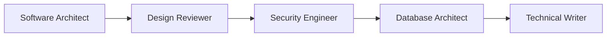
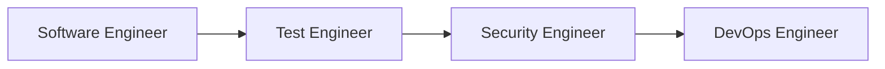
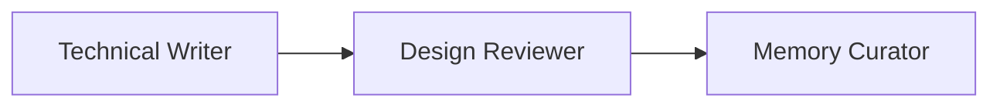

# Gorka System User Onboarding Guide
*Last updated: 2025-07-24T16:14:41+02:00 (Europe/Warsaw)*
*Version: 1.0.0*
*Status: APPROVED*

## Document History
| Version | Date | Time | Author | Status | Changes |
|---------|------|------|--------|--------|---------|
| 1.0.0 | 2025-07-24 | 16:14:41 | @bohdan-shulha | Approved | Initial user onboarding guide |

## Welcome to Gorka

Gorka is a comprehensive AI agent ecosystem designed to accelerate software development through specialized AI agents. This guide will get you up and running in minutes.

## What You'll Learn

- How to install and configure Gorka
- Understanding the available agents and their roles
- Basic workflows for common development tasks
- Best practices for working with AI agents

## Prerequisites

### System Requirements
- **Operating System**: macOS or Linux
- **VS Code**: Latest version with Python extension
- **Git**: For repository operations
- **Internet Connection**: For downloading components

### Skills Assumed
- Basic command-line familiarity
- VS Code usage experience
- Basic understanding of software development concepts

## Quick Start (5 Minutes)

### Step 1: Install Gorka CLI
```bash
# Download and install Gorka
curl -fsSL https://raw.githubusercontent.com/gork-labs/gorka/main/setup.sh | bash

# Verify installation
gorka help
```

### Step 2: Choose Installation Type

**Option A: Global Installation (Recommended for beginners)**
```bash
# Install for all VS Code projects
gorka install --global
```

**Option B: Workspace Installation (Project-specific)**
```bash
# Navigate to your project
cd your-project-directory

# Install for this project only
gorka install
```

### Step 3: Open VS Code and Test
1. Open VS Code in your project directory
2. Open Command Palette (`Cmd/Ctrl + Shift + P`)
3. Type "Chat: Focus on Chat View"
4. Look for available chatmodes in the chat interface

## Understanding Gorka Agents

Gorka provides 10 specialized AI agents, each designed for specific development tasks:

### Core Architecture Agents
- **🏗️ Software Architect**: Creates comprehensive system designs and architecture documents
- **📋 Design Reviewer**: Reviews and validates technical designs with structured feedback
- **🗄️ Database Architect**: Designs scalable data solutions and database schemas

### Development Agents
- **👨‍💻 Software Engineer**: Implements high-quality, maintainable code with >80% test coverage
- **🧪 Test Engineer**: Creates comprehensive testing strategies and quality assurance plans
- **🔒 Security Engineer**: Implements security best practices and vulnerability assessments

### Operations & Documentation
- **⚙️ DevOps Engineer**: Manages infrastructure, CI/CD, and operational concerns
- **📝 Technical Writer**: Creates clear, comprehensive documentation for all audiences
- **✍️ Prompt Writer**: Optimizes AI interactions and prompt engineering

### System Intelligence
- **🧠 Memory Curator**: Maintains the knowledge graph and system memory quality

## Core Concepts

### Sequential Thinking
Every Gorka agent uses structured reasoning with **minimum 7-15 thoughts** for complex tasks:
- **7-9 thoughts**: Simple analysis and planning
- **10-12 thoughts**: Standard problem-solving
- **13-15+ thoughts**: Complex architecture and design decisions

### Memory Integration
Agents maintain a persistent knowledge graph that tracks:
- Domain concepts and business rules
- Architectural decisions and their rationale
- System capabilities and constraints
- Project-specific context and patterns

### Documentation-First Approach
Gorka emphasizes creating comprehensive documentation:
- All design decisions are documented in `docs/architecture/`
- User guides and API references in `docs/guides/` and `docs/api/`
- Every document includes proper metadata and version tracking

## Your First Week with Gorka

### Day 1: Basic Setup and Exploration
1. **Complete Quick Start** (above)
2. **Explore Available Agents**:
   - Try chatting with the Software Architect about a simple system design
   - Ask the Technical Writer to create a README for a project
3. **Review Generated Files**:
   - Check `.vscode/mcp.json` for MCP server configurations
   - Look at `.github/chatmodes/` for available agent profiles

### Day 2-3: Simple Project Workflow
1. **Start with Software Architect**:
   ```
   "I need to design a user authentication system for a web application"
   ```
2. **Review the Design**:
   - Software Architect will create documentation in `docs/architecture/`
   - Use Design Reviewer to validate the approach
3. **Implement with Software Engineer**:
   - Ask Software Engineer to implement key components
   - Focus on high-quality, testable code

### Day 4-5: Advanced Features
1. **Memory System**:
   - Check `.vscode/memory.json` to see captured knowledge
   - Use Memory Curator to review and organize domain knowledge
2. **Documentation**:
   - Ask Technical Writer to create user guides
   - Generate API documentation for your services
3. **Security Review**:
   - Use Security Engineer to review authentication implementation
   - Address security concerns and best practices

### Week 1 Review
- **Assess Progress**: What worked well? What was challenging?
- **Check Documentation**: Review all generated docs in `docs/` directory
- **Memory Review**: Use Memory Curator to see captured domain knowledge
- **System Update**: Run `gorka update sync` to get latest improvements

## Common Workflows

### Architecture Design Workflow


1. **Software Architect**: Creates initial design
2. **Design Reviewer**: Reviews and validates approach
3. **Security Engineer**: Reviews security implications
4. **Database Architect**: Reviews data design (if applicable)
5. **Technical Writer**: Creates user-facing documentation

### Implementation Workflow


1. **Software Engineer**: Implements features
2. **Test Engineer**: Creates comprehensive tests
3. **Security Engineer**: Security review and hardening
4. **DevOps Engineer**: Deployment and operational concerns

### Documentation Workflow


1. **Technical Writer**: Creates documentation
2. **Design Reviewer**: Reviews for accuracy and completeness
3. **Memory Curator**: Captures key concepts in knowledge graph

## Best Practices

### Working with Agents

#### Be Specific and Context-Rich
✅ **Good**: "Design a user authentication system for a Node.js web application with JWT tokens, supporting email/password and OAuth2 (Google, GitHub), with rate limiting and MFA"

❌ **Poor**: "Design auth"

#### Provide Project Context
- Share relevant existing code or documentation
- Explain business requirements and constraints
- Mention performance or scalability requirements
- Include any compliance or security requirements

#### Leverage Sequential Thinking
- Let agents work through complex problems systematically
- Don't interrupt the thinking process
- Review the reasoning, not just the conclusions
- Ask follow-up questions based on the thinking process

### File Organization

Gorka creates a standard project structure:
```
your-project/
├── .vscode/
│   ├── mcp.json          # MCP server configurations
│   ├── gorka.json        # Gorka metadata tracking
│   └── memory.json       # Knowledge graph storage
├── .github/
│   ├── chatmodes/        # Available agent profiles
│   └── instructions/     # Agent instruction files
└── docs/
    ├── architecture/     # System design documents
    ├── guides/          # User guides and tutorials
    ├── api/            # API documentation
    └── cli/            # CLI references
```

### Maintenance Routines

#### Weekly Maintenance
```bash
# Update all components
gorka update sync

# Check system status
gorka update list

# Clean up outdated components
gorka update clean-orphans

# Update gorka binary
gorka self-upgrade
```

#### Monthly Review
1. **Memory Cleanup**: Use Memory Curator to review knowledge graph
2. **Documentation Audit**: Ensure all docs are current and accurate
3. **Agent Performance**: Assess which agents are most valuable
4. **System Optimization**: Remove unused configurations

## Troubleshooting

### Common Issues

#### "No MCP servers found"
**Problem**: VS Code doesn't see the MCP configurations
**Solution**:
```bash
# Reinstall configurations
gorka install --global

# Restart VS Code
# Check .vscode/mcp.json exists and is valid JSON
```

#### "Chatmodes not appearing"
**Problem**: Agent profiles don't show up in chat interface
**Solution**:
```bash
# Check chatmodes were copied
ls .github/chatmodes/

# Resync if missing
gorka update sync

# Restart VS Code
```

#### "Permission denied" during installation
**Problem**: Can't write to installation directories
**Solution**:
```bash
# For global installation issues:
sudo gorka install --global

# Or use workspace installation instead:
gorka install
```

#### "Repository access failed"
**Problem**: Can't download latest updates
**Solution**:
```bash
# Clear cache and retry
gorka clean
gorka update sync

# Check internet connection
# Verify GitHub access
```

### Getting Help

#### Check System Status
```bash
# See what's installed
gorka update list

# Check available components
gorka update list available

# View CLI help
gorka help
```

#### Reset to Known State
```bash
# Clear cache
gorka clean

# Reinstall everything
gorka update sync

# Upgrade binary
gorka self-upgrade
```

#### Memory Issues
If memory system seems corrupted:
```bash
# Backup current memory
cp .vscode/memory.json .vscode/memory.json.backup

# Reset memory file
echo '{}' > .vscode/memory.json

# Use Memory Curator to rebuild knowledge
```

## Advanced Usage

### Custom Agent Configuration
Once comfortable with basics, you can:
- Modify agent instructions in `.github/instructions/`
- Customize MCP server configurations
- Add project-specific memory entities
- Create custom documentation templates

### Multi-Project Management
For teams managing multiple projects:
- Use global installation for consistent experience
- Sync configurations across projects with `gorka update sync`
- Maintain project-specific memory graphs
- Share architectural decisions via memory export/import

### Integration with Existing Workflows
- Incorporate Gorka agents into code review processes
- Use Design Reviewer for architecture review gates
- Integrate Technical Writer into documentation pipelines
- Use Memory Curator for knowledge management

## Next Steps

### Week 2-4: Mastery
1. **Deep Integration**: Use agents for all design and implementation tasks
2. **Memory Optimization**: Use Memory Curator to build comprehensive domain knowledge
3. **Documentation Excellence**: Create comprehensive project documentation
4. **Team Adoption**: Share knowledge and best practices with team members

### Advanced Features to Explore
- **Custom Instructions**: Modify agent behaviors for your domain
- **Memory Relationships**: Build complex knowledge graphs
- **Documentation Automation**: Integrate with CI/CD pipelines
- **Performance Optimization**: Monitor and optimize agent effectiveness

### Community and Support
- **Documentation**: Comprehensive guides in `/docs/` directory
- **CLI Reference**: Complete command documentation
- **System Architecture**: Understanding the underlying design
- **Best Practices**: Proven patterns for success

## Success Metrics

Track your progress with these indicators:

### Week 1 Goals
- [ ] Successful installation and basic agent interaction
- [ ] First architecture document generated
- [ ] Basic understanding of agent roles
- [ ] Comfortable with CLI basics

### Month 1 Goals
- [ ] Regular use of 5+ agents
- [ ] Comprehensive project documentation
- [ ] Active knowledge graph with domain concepts
- [ ] Integration into daily development workflow

### Long-term Success
- [ ] Significant reduction in documentation time
- [ ] Improved design quality and consistency
- [ ] Enhanced team collaboration through shared knowledge
- [ ] Reduced onboarding time for new team members

Welcome to the future of AI-assisted development with Gorka!
